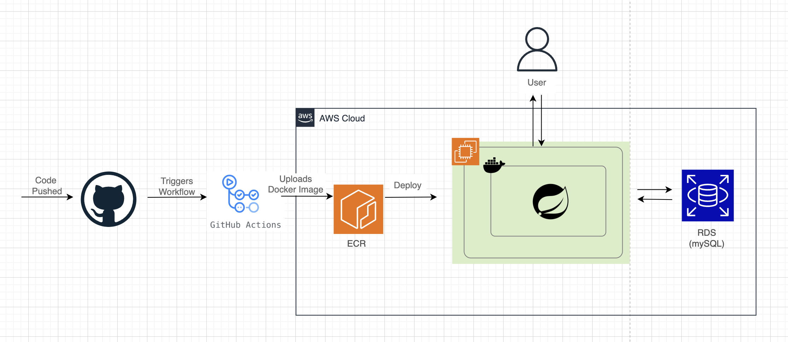
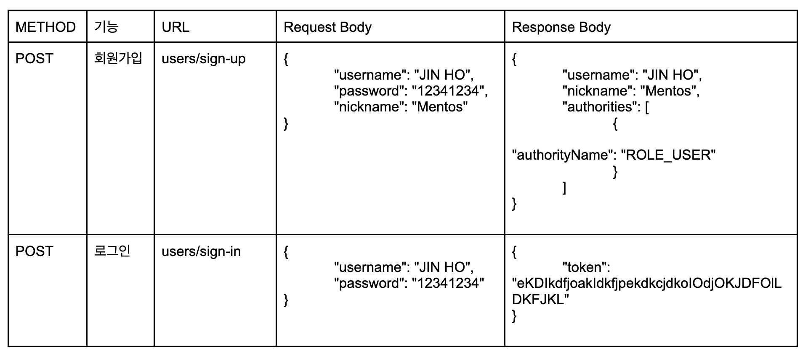
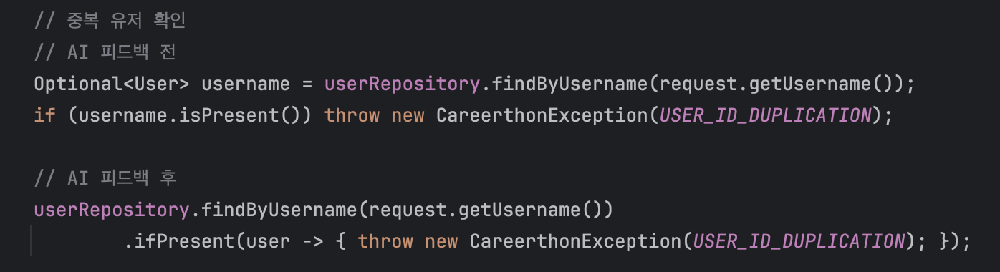
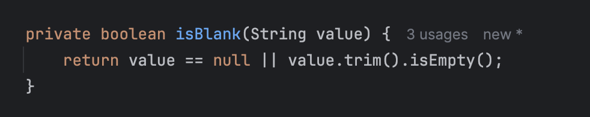
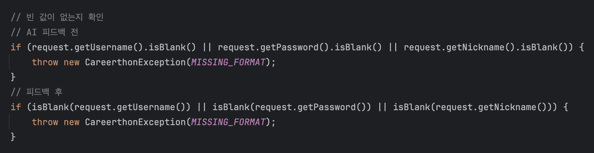
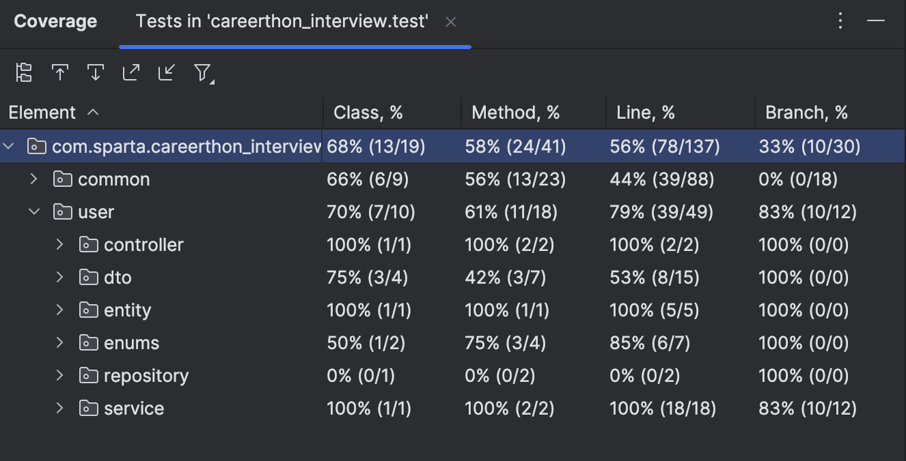

# Careerthon Interview Project

## Summary
Spring security와 JWT를 이용한 회원가입 및 로그인 기능 구현.

## Service Architecture

## API Documentation ([Swagger UI Link 🔗](http://3.36.103.97:8080/swagger-ui/index.html))

## AI Feedback
chatGPT에게 코드 피드백을 요청했고, 대표적으로 UserService 코드에서 개선이 이루어졌다.

__개선1: 회원가입에서 아이디 중복체크를 하는 코드를 더 간결하고 가독성 높게 작성하기__  

__개선2: 회원가입 및 로그인에서 필드값이 빌경우 뿐만이 아니라 whitespace이거나 null일 경우 예외처리__  

## Test Code Coverage

